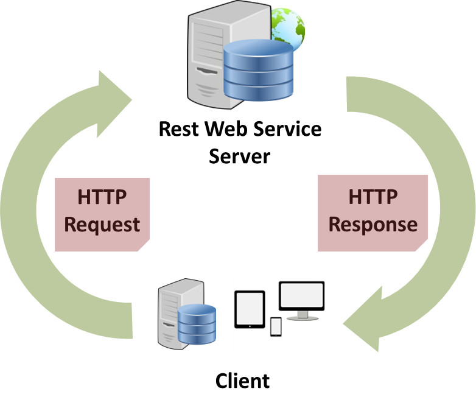

REST(ful)
===

30.1 Créer un projet web dynamique (nous n'utiliserons pas maven, ni spring ici, vous devez avoir installer Tomcat)

30.2 Ajouter au repertoire lib les jars de Jersey (incluant jackson permettant le mapping objet/json)

30.3 Ajouter les dependances dans le fichier web.xml (servlet, paramètres, servlet-mapping)

30.4 Création d'un web service permettant une gestion simplifiée (sans bdd) d'une appli bancaire en ligne
  - 30.4.1 création de votre classe "BanqueRest" qui permet de renvoyer une valeur au carré
  - 30.4.2 ajouter à celle ci une méthode qui renvoi un compte à partir d'un code
  - 30.4.3 créer donc la classe Compte avec pour attributs code, solde, dateCréation
  - 30.4.4 Ajouter enfin la méthode listComptes qui renvoie l'ensemble des comptes contenus dans la classe BanqueRest sous forme d'Arraylist de Compte
  - 30.4.5 Ajouter les annotations Jax-Rs pour faire de BanqueRest un web service (informations produites au format JSON)
  
30.5 Ajouter votre service à Tomcat et démarrer le puis tester votre méthode de conversion sur un navigateur

30.6 Tester getCompte puis listComptes sur firefox puis chrome, qu'observez vous ?

30.7 changer le format des informations produites en xml au lieu de json, que constatez vous ? 
 et comment résoudre ce problème ?
 
30.8 Ajouter un moyen de gérer ces types 2 de données Xml et Json 

30.9 Ajouter Advanced Rest Client(ARC) à Chrome puis tester l'envoi de requetes Xml et Json

30.10 Ajouter des méthodes à votre service web afin d'ajouter des comptes, mettre à jour, supprimer, tester le tout et commanter votre code

30.11 Demander enfin au serveur de générer le WADL

30.12 Envoyer votre lien Github

Ressources
===

Comprendre REST en comparaison avec SOAP
[YouTube](https://www.youtube.com/watch?v=OC-jSy7GLSM)

Jersey, une implémentation de reference de JAX-RS
[Jersey](https://jersey.github.io/)

Json, une notation pour créer simplement des objets javascript
[Manipuler des données JSON \| MDN](https://developer.mozilla.org/fr/docs/Learn/JavaScript/Objects/JSON)

Xml, incontournable !
[Structurez vos données avec XML - OpenClassrooms](https://openclassrooms.com/en/courses/1766341-structurez-vos-donnees-avec-xml)

Concrètement, tout ça donne quoi ?
[YouTube](https://www.youtube.com/watch?v=QYv47lhXP2E)
